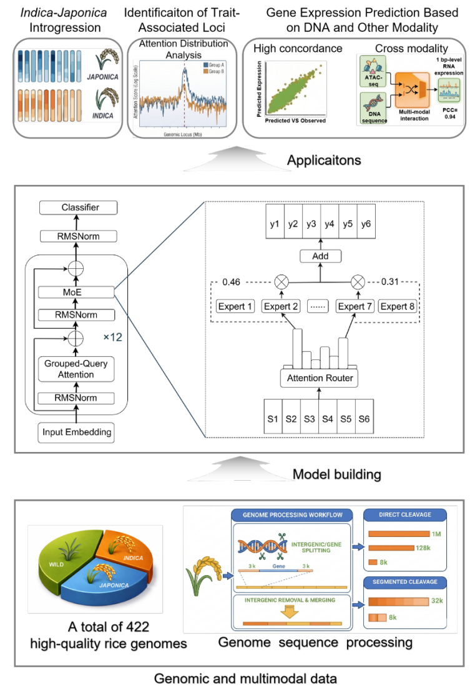
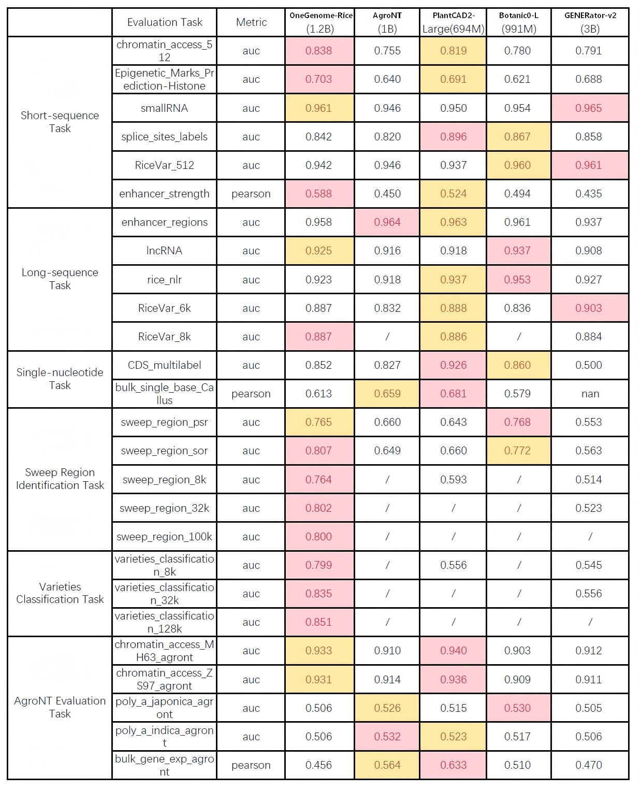

# OneGenome-Rice (OGR): A Genomic Foundation Model for Rice

<div align="center">
    
</div>

## 1. Introduction

**OneGenome-Rice(OGR)** is a foundational AI infrastructure for the next generation of AI-driven precision breeding and functional genomics in rice.
OGR is a generative genomic foundation model designed to process DNA sequences up to 1 million base pairs in length. The model features 1.25 billion total parameters, utilizing a Mixture of Experts (MoE) architecture that allows for high representational capacity while maintaining computational efficiency during inference. OGR was pre-trained on a curated corpus of 422 rice genomes, representing a diverse array of genotypes from the rice genome group, which includes both modern high-yielding varieties and wild ancestral populations. We detail the architectural innovations, dataset composition, and application-specific findings that define OGR.

## 2. Model Information

The following figure illustrates the overall workflow of the model, including training data processing, model architecture, training process and downstream model inference and applications.

<div align="center">
    
</div>

The subsections below summarize training data, model architecture, and training process.

### Training Data

The training corpus is a **QC-filtered pangenome of 422 rice genomes** spanning cultivated and wild *Oryza* diversity. For preprocessing and sampling details, see the [table](figure/422%20Curated%20Assembled%20Genome%20Collection.tsv)

- **Provenance:** assemblies come from **open datasets** published in the literature (public archives and associated papers).
- **Encoding:** raw DNA with a nucleotide-level tokenizer (A/T/C/G/N and special tokens).

### Model Architecture

OGR follows a Transformer decoder with **Mixture-of-Experts (MoE)** layers. Main technical highlights:

- **Ultra-long context:** **RoPE** with base **50M** supports up to **1M** tokens; multi-stage training scales the effective context window.
- **Efficient attention:** **GQA** with **16** heads and **8** KV groups, paired with **Flash Attention** kernels.
- **MoE routing:** **8** experts, **top-2** per token, **SwiGLU** experts, **RMSNorm**; objective is **next-token prediction (NTP)**.

The following table summarizes key specifications.

<div align="center">

<table>
  <thead>
    <tr>
      <th align="center"><strong>Model Specification</strong></th>
      <th align="center"><strong>OneGenome-Rice (OGR)</strong></th>
    </tr>
  </thead>
  <tbody>
    <tr>
      <td align="center" colspan="2"><strong>Model Scale</strong></td>
    </tr>
    <tr>
      <td align="center">Total Parameters</td>
      <td align="center">1.25B</td>
    </tr>
    <tr>
      <td align="center">Activated Parameters</td>
      <td align="center">0.33B</td>
    </tr>
    <tr>
      <td align="center" colspan="2"><strong>Architecture</strong></td>
    </tr>
    <tr>
      <td align="center">Architecture</td>
      <td align="center">MoE</td>
    </tr>
    <tr>
      <td align="center">Number of Experts</td>
      <td align="center">8</td>
    </tr>
    <tr>
      <td align="center">Selected Experts per Token</td>
      <td align="center">2</td>
    </tr>
    <tr>
      <td align="center">Number of Layers</td>
      <td align="center">12</td>
    </tr>
    <tr>
      <td align="center">Attention Hidden Dimension</td>
      <td align="center">1024</td>
    </tr>
    <tr>
      <td align="center">Number of Attention Heads</td>
      <td align="center">16 (GQA, 8 KV groups)</td>
    </tr>
    <tr>
      <td align="center">MoE Hidden Dimension (per Expert)</td>
      <td align="center">4096</td>
    </tr>
    <tr>
      <td align="center">Vocabulary Size</td>
      <td align="center">128 (padded)</td>
    </tr>
    <tr>
      <td align="center">Context Length</td>
      <td align="center">up to 1Mb</td>
    </tr>
  </tbody>
</table>

</div>

### Training Process

OGR pre-training is built on **[Megatron-LM](https://github.com/NVIDIA/Megatron-LM)** with **5D parallelism** (**TP, PP, CP, DP, EP**).

- **Key Features**

  - **MoE:** 8 experts, Top-2 routing, sparse FFN execution
  - **GQA:** grouped-query attention for lower KV memory
  - **RoPE:** base **50M**, supports ultra-long context
  - **Modern stack:** RMSNorm, SwiGLU, Flash Attention
- **Pre-training Strategy**

  - **Objective:** self-supervised Next Token Prediction (**NTP**)
  - **Progressive Context Scaling:** **8K → 32K → 128K → 1M** tokens
  - **Data**: high-quality, chromosome-scale de novo assemblies from publicly available resources
  - **Tokenizer:** one-hot DNA encoding (A, T, C, G, N)
- **Infrastructure**

  - **Framework:** Megatron-LM on 128 GPUs
  - **Parallelism:** 5D strategy (TP, PP, CP, DP, EP)
  - **Batch:** Global **1024**, Micro **1**
  - **Optimizer:** AdamW (distributed sharded)
  - **Learning rate:** peak **1e-4**, cosine decay, warm-up in **5-10%** range
  - **Precision:** **BF16** compute, **FP32** for softmax/gradients/routing
- **Key Optimizations**

  - **MoE load balancing:** auxiliary loss **1×10⁻³** + router **Z-loss 1×10⁻³**
  - **Communication / compute:** grouped **GEMM**, **AllToAll** dispatch, overlapped parameter aggregation and gradient reduction
  - **I/O:** **cyclic** data loader with **8** worker processes
  - **Memory / attention:** Flash Attention; GQA for KV efficiency

## 3. Performance Evaluation

  Across the 26 benchmark categories, OGR ranks first or second in 16 tasks, demonstrating strong overall performance and robust generalization across diverse genomic prediction tasks. The model performs particularly well in key regulatory and functional prediction tasks, including chromatin accessibility, histone modification, small RNA prediction, enhancer strength prediction, sweep region identification, and varieties classification, indicating its effectiveness in capturing genomic regulatory signals and functional patterns across multiple biological scales.

- **Short-sequence tasks:** OGR exhibits competitive overall performance, with strong results in chromatin accessibility, epigenetic mark prediction, and small RNA prediction, but relatively weaker performance in splice site recognition and variant detection.
- **Long-sequence tasks:** The model maintains stable performance across diverse tasks, showing advantages in variant detection over longer contexts, though it does not consistently lead in all categories.
- **Single-nucleotide tasks:** OGR shows a noticeable performance gap in high-resolution predictions, reflecting limited capacity for nucleotide-level modeling.
- **Sweep region identification:** The model demonstrates clear advantages in long-context settings (8kb–100kb), highlighting its ability to capture large-scale genomic signals.
- **Varieties classification:** OGR consistently outperforms other models across increasing sequence lengths, emphasizing its capability in population structure and evolutionary pattern recognition.
- **AgroNT benchmark tasks:** The model achieves strong performance in chromatin accessibility prediction but shows limitations in poly(A) site and gene expression prediction, reflecting weaknesses in fine-grained regulatory modeling.

<div align="center">
    
</div>

## 4. Quickstart

### Docker Deployment

We strongly recommend deploying OGR using Docker.

Pull the Docker Image

```
docker pull zjlabogr/onegenomerice:mega
```

Run the Container

```
docker run -it --gpus all --shm-size 32g zjlabogr/onegenomerice:mega /bin/bash
```

### Model Download

OGR models are available for download from [Hugging Face](https://huggingface.co/ZhejiangLab/OneGenomeRice) and [ModelScope](https://modelscope.cn/models/zhejianglab/OneGenomeRice). Each model employs a hybrid Mixture-of-Experts (MoE) architecture and supports analysis at single-nucleotide resolution.

<div align="center">

| **Model** | **Total Params** |                      **Hugging Face**                      |                         **ModelScope**                         |
| :-------------: | :--------------------: | :--------------------------------------------------------------: | :------------------------------------------------------------------: |
|    OGR-1.25B    |         1.25B         | [🤗 Hugging Face](https://huggingface.co/ZhejiangLab/OneGenomeRice) | [🤖 ModelScope](https://modelscope.cn/models/zhejianglab/OneGenomeRice) |

</div>

## 5. Application Scenarios

To further illustrate the practical value, extensibility, and potential of OGR, we present four representative application cases.

- **Case 1: [Identification of *indica-japonica* Introgression](applications/1.identification_of_indica-japonica_introgression/README.md)**

  This case aims to exploit the capacity of the OGR foundation model for fine-scale inference of subspecies origin across the rice genome, enabling the identification of introgression between *indica* (Oryza sativa subsp. *indica*) and *japonica* (Oryza sativa subsp. *japonica*). Unlike traditional approaches that rely on SNP-based statistics or local sequence alignment, this study starts directly from raw genomic sequences. High-dimensional embeddings are extracted based on the OGR model, upon which downstream predictive models are built. This approach enables the capture of deep genetic structural differences at the sequence level, facilitating the identification of potential introgressed regions between subspecies.
- **Case 2: [Trait-Associated Loci Finding](applications/2.identification_of_trait-associated_loci/Readme.md)**

  This repository demonstrates a reproducible workflow for identifying rice candidate loci from bidirectional attention signals produced by OneGenome-Rice. The workflow reconstructs sample-specific sequences from variants, extracts forward and reverse-complement attention, performs position-level group comparisons, and summarizes gene-level differential signals in selected candidate regions.
- **Case 3: [Gene Expression Prediction of DNA Sequence](applications/3.gene_expression_prediction_of_DNA_sequence/README.md)**

  This repository implements a scalable, multi-modal deep learning framework for single-nucleotide resolution RNA-seq prediction. Given a genomic DNA sequence window, the model learns to predict strand-specific transcriptional output by jointly modeling sequence context and regulatory signals. The architecture leverages a pre-trained DNA foundation model as a sequence encoder, paired with a U-Net-style regression head designed for multi-track genomic signal prediction. The framework supports full-parameter fine-tuning, distributed data-parallel training, and efficient inference, enabling downstream applications such as cis-regulatory variant effect prediction, allele-specific expression modeling, and transcriptome-informed breeding design.

- **Case 4: [Gene Expression Prediction Based on Multi-modal Data](applications/4.gene_expression_prediction_based_on_multi_modal_data/senario.md)**

  A central challenge in predictive genomics is linking static DNA sequence to dynamic, context-specific gene expression and traits. This scenario targets a concrete prediction task: given a genomic DNA sequence window and its aligned chromatin accessibility signal (ATAC-seq), predict the corresponding strand-specific RNA-seq signal at single-nucleotide resolution. By modeling DNA–ATAC interactions explicitly, the system aims to separate sequence-encoded potential from context-dependent activation, enabling base-level expression prediction that can support downstream analyses such as comparing regulatory conditions or simulating the effects of perturbations in silico.

## 6. License and Uses

**License**：The OGR collection of models are licensed under the  [Apache License 2.0](LICENSE).

**Primary intended use**：The primary use of OGR models is to support rice genomics research, providing researchers with advanced analytical capabilities and long-context modeling tools powered by large-scale foundation models trained on rice genomes.

**Out-of-scope use**：OGR models are not intended for use in any manner that violates applicable laws or regulations, nor for any activities prohibited by the license agreement.

**Ethical Considerations and Limitations**: Like other foundation models, OGR models may exhibit behaviors that carry potential risks. They may generate inaccurate outputs when interpreting rice genomic sequences or making inferences. Therefore, users should conduct rigorous validation and apply appropriate safeguards before using OGR in downstream research. Developers deploying applications based on OGR must carefully assess risks specific to their use cases.

## 7. Citation and Acknowledgements

The model training process was conducted on the 021 Large Science Model, Zero2X open platform, and Nanhu Computing Framework.

## 8. Contact(TODO!)

For project-related questions, please submit an [issue](https://github.com/ZhejiangLab/OneGenomeRice/issues).

For general inquiries, you can reach us at:
📧[opensource@zhejianglab.org](mailto:opensource@zhejianglab.org) · 📧[OneGenomeRice@zhejianglab.org](mailto:OneGenomeRice@zhejianglab.org) · 📧[bgi-plant@genomics.cn](mailto:bgi-plant@genomics.cn)
