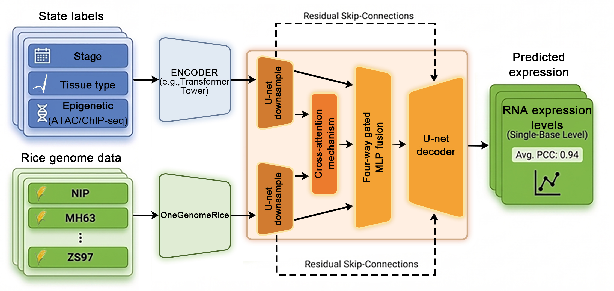
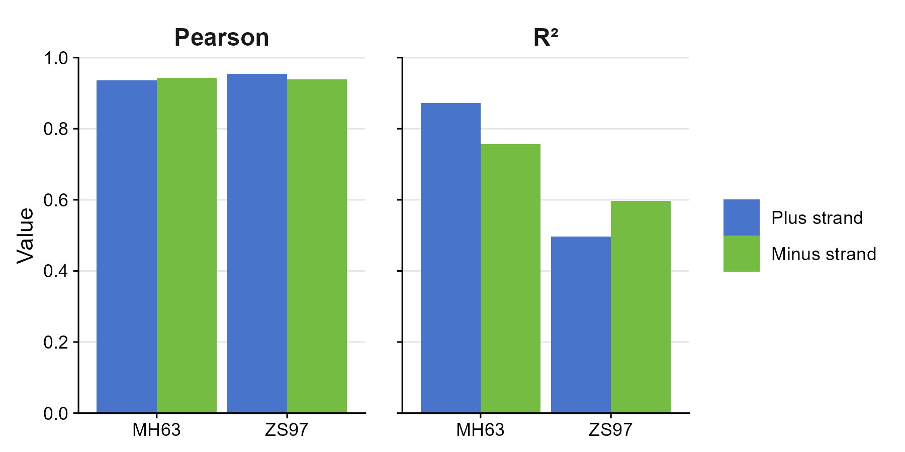

# Gene Expression Prediction Based on Multi-modal Data
## 1. Overview
A central challenge in predictive genomics is linking static DNA sequence to dynamic, context-specific gene expression and traits.
This scenario targets a concrete prediction task: given a genomic DNA sequence window and its aligned chromatin accessibility signal (ATAC-seq), predict the corresponding strand-specific RNA-seq signal at single-nucleotide resolution. By modeling DNA–ATAC interactions explicitly, the system aims to separate sequence-encoded potential from context-dependent activation, enabling base-level expression prediction that can support downstream analyses such as comparing regulatory conditions or simulating the effects of perturbations in silico.

## 2. Data Analysis
### Data Sources
The preliminary performance of this architecture was evaluated using a curated dataset of biosamples with paired reference genomes, ATAC-seq, and RNA-seq data (Zhu et al., 2024). 
### Input & Output Data
The task is formulated as a regression problem. The model takes 32kb genomic DNA sequence windows as input and conditions the prediction on chromatin accessibility (ATAC-seq) signals aligned to the same coordinates. The output is strand-specific RNA-seq signal values at single-nucleotide resolution (plus and minus strands), enabling base-level prediction of expression conditioned on both genetic sequence and regulatory state.

## 3. Model Design
### Model Architecture
To explore this approach, we developed a cross-modal prediction framework consisting of four integrated components. The AgriGenome foundation model was employed as the core DNA encoder, with only the final layer unfreezed to utilize its pre-trained genomic representations. This was paired with a relatively lightweight Transformer tower designed to process chromatin accessibility (ATAC-seq) signals. These modalities were integrated via a cross-attention mechanism and a four-way gated MLP (Multi-Layer Perceptron) fusion layer, which subsequently informed a U-Net decoder. To help preserve spatial resolution, the decoder utilized residual skip-connections from both the DNA and ATAC encoders for single-base level predictions.

In the current fusion implementation fusion is performed at \(L/4\) resolution via bidirectional cross-attention (ATAC \(\rightarrow\) DNA and DNA \(\rightarrow\) ATAC), followed by a token-wise 4-way gated fusion over: ATAC self features, DNA self features, and the two cross-attended features. The fused representation is then refined through a post-fusion bottleneck and decoded back to full resolution with a U-Net-style upsampling path. At full resolution, a dual-skip gated injection mixes DNA and ATAC skip features to preserve spatial detail for single-base predictions, and the final head produces two output channels (plus and minus strands).

###  Training Optimization
The model is trained with mean squared error (MSE) as the regression objective. The fusion predictor supports optional entropy regularization for the fusion gate and skip gate as a fraction of the MSE, encouraging more even gate usage while keeping the primary MSE gradients unchanged.

## 4. Evaluation
### Metrics
Following training on specific tissue-stage-cultivar combinations, the model's predictive accuracy was assessed on unseen samples.
The predictive accuracy was assessed using standard regression metrics at single-nucleotide resolution, including the Pearson correlation coefficient (PCC) and the coefficient of determination (\(R^2\)).

### Evaluation Results
In the test set, the single-base level PCC between predicted and observed values reached an average of 0.94 (range 0.936–0.954). This high correlation suggests that the model effectively captures the relative abundance and spatial distribution of the RNA expression spectrum. However, the \(R^2\) exhibited greater variability across experiments, with values ranging from 0.50 to 0.97. This fluctuation highlights the inherent challenge of accurately recovering the absolute scale of expression levels, particularly for data characterized by a high dynamic range (where the maximum-to-minimum ratio exceeds \(10^5\)). Overall, these metrics indicate that the model is capable of capturing significant interaction patterns between chromatin architecture and DNA sequences that regulate RNA expression. While further validation remains necessary, these initial results suggest that AgriGenome may serve as a useful information operator within multi-modal architectures, contributing to the continued advancement of agricultural research.

## References

1. Zhu, T. et al. (2024). *Comprehensive mapping and modelling of the rice regulome landscape unveils the regulatory architecture underlying complex traits*. **Nature Communications**, 15, 6562. `https://www.nature.com/articles/s41467-024-50787-y`

