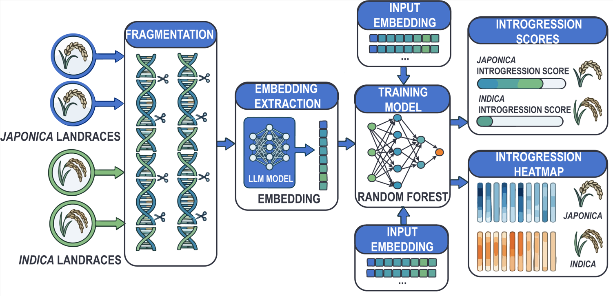
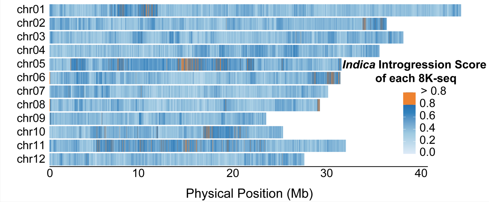

# **情景Ⅰ：*Indica*-*Japonica* 血缘渗入识别**

> 英文版见 [README.md](README.md)

## **1. 任务描述**

本任务旨在利用 OneGenome-Rice 基础模型的表征学习能力，在全基因组尺度上对亚种来源进行细粒度推断，从而识别 *indica*（稻亚种 *Indica*）与 *japonica*（稻亚种 *Japonica*）之间的血缘渗入。与传统依赖 SNP 统计或局部序列比对的方法不同，本研究直接从原始基因组序列出发，使用 OneGenome-Rice 模型提取高维嵌入并构建下游预测模型，以在序列层面捕获深层遗传结构差异，并辅助识别亚种间潜在血缘渗入区段。

## **2. 数据来源与处理**

本研究使用来源清晰、注释完善的高质量水稻组装基因组，包括：

数据基础：一组高质量组装水稻基因组

亚群划分：依据 RiceVarMap 数据库的亚群标签

样本选取：选取与 3KRGP（3K Rice Genome Project）重叠的样本，再经全基因组变异主成分分析（PCA）进一步筛选；最终在 *indica* 与温带 *japonica* 群体中各选取 10 份代表性样本，以在保留亚群内遗传多样性的同时，尽量减少育种历史中血缘渗入带来的干扰。此外从 *indica* 与 *japonica* 各另选 1 份代表性样本，构建独立测试集用于评价。

## **3. 任务设计**

### **(1) 总体框架**

模型以 OneGenome-Rice 基础模型为底座。与常规微调不同，本研究**不更新**基础模型参数，而是对每个 8 kb 序列直接提取嵌入，并在此基础上构建轻量级下游预测模型，核心流程如下：



**数据构建与划分**：收集 *indica* 与 *japonica* 的全基因组序列，在**个体层面**划分为训练集与测试集（比例约 10:1）。

**基因组窗口切分**：将每条基因组划分为固定长度滑动窗口（8 kb），得到覆盖全基因组的序列片段集合。

**序列表征提取**：使用 OneGenome-Rice 对每个 8 kb 片段编码，得到高维嵌入表示。

**下游建模**：在嵌入上训练随机森林，学习从序列表征到亚群归属概率的映射（$P_{\mathrm{indica}}$：属于 *indica* 的概率；$P_{\mathrm{japonica}}$：属于 *japonica* 的概率）。

**血缘渗入图谱构建与评价**：在测试集上生成预测，将概率沿染色体坐标可视化，构建血缘渗入图谱。同时，采用AUC、ACC等指标对模型性能进行定量评估。

### **(2) 模型评价**

在测试集上，以各样本真实亚群标签评价模型表现；分类性能采用 AUC（曲线下面积）与 ACC（准确率），共同反映模型区分亚种来源的整体能力。

| **测试集** | **分类器** | **ACC** | **AUC** |
| --- | --- | --- | --- |
| 1 Temperate *Japonica* | Random Forest | 0.804 | 0.794 |
| + 1 *Indica* | (n_estimators=100) |  |  |

根据亚群概率（$P_{\mathrm{indica}}$ 与 $P_{\mathrm{japonica}}$），基因组区段按如下规则分类：

- 若任一概率大于 0.8，则将该区段判为对应亚种；
- 若两个概率均低于 0.8，或两个概率均高于 0.8，则判为低分化区，表示亚种信号弱或模糊。

该策略有助于识别：1）亚种来源较纯的区段；2）潜在血缘渗入区段；3）保守共有区段。

### **(3) 案例研究**

我们尝试将该框架用于分析 *japonica* 品种盐丰 47（YF47）中的 *indica* 血缘渗入；该品系代表历史上亚种间杂交育种形成的育种系。这些区段多呈连续区块而非孤立位点，表明血缘渗入在区段尺度上被捕获，与育种过程中相邻基因组片段一并发生血缘渗入的现象一致。



## **(4) 项目结构**

**目录树：**

```
Introgression_Analysis/
├── README.md                          # 英文文档
├── README_zh.md                       # 中文文档
├── requirements.txt                   # Python 依赖列表
├── run_train_rf.sh                    # 运行训练流程的脚本
├── run_variety_inference.sh           # 运行推理流程的脚本
│
├── scripts/                           # 主要执行脚本
│   ├── train_rf.py                    # 在嵌入上训练随机森林
│   └── variety_inference.py           # 全基因组推理与计算指标
│
├── benchmarks/                        # 嵌入提取工具
│   ├── __init__.py
│   └── embedding_extract.py           # JSONLDataset 与嵌入工具类
│
├── utils/                             # 数据处理工具
│   ├── __init__.py
│   ├── genomic_window_egmentation.py  # 将 FASTA 转为窗口化 JSONL
│   ├── compute_metrics.py             # 指标计算助手函数
│   └── utils.py                       # 通用工具函数
│
├── config/                            # 配置文件
│   ├── train_rf_config.yaml           # 训练超参与路径配置
│   ├── variety_inference_config.yaml  # 推理参数配置
│   └── datasets_info.yaml             # 数据集字段定义
│
├── data/                              # 输入/输出数据目录
│   ├── datasets_info.yaml             # 声明数据集格式
│   └── rice_introgression_jap-ind/    # 数据集划分（预处理后生成）
│       ├── train.jsonl                # 训练集 JSONL
│       └── test.jsonl                 # 测试集 JSONL
│
├── fasta_data/                        # 输入 FASTA 文件
│   ├── 01.genome.fa                   # 日本稻训练基因组
│   ├── 02.genome.fa                   # 印度稻训练基因组
│   ├── 03.genome.fa                   # 日本稻测试基因组
│   └── 04.genome.fa                   # 印度稻测试基因组
│
├── model/                             # 基础模型权重
│   └── rice_1B_stage2_8k_hf/          # OneGenome-Rice 模型目录
│       ├── config.json
│       ├── model.safetensors          # 模型权重
│       └── tokenizer.json
│
├── embedding_path/                    # 缓存的嵌入（生成）
│   └── rice_1B_stage2_8k_hf/          # 按模型分类的嵌入
│       ├── rice_introgression_jap-ind-12layer_train.pt
│       └── rice_introgression_jap-ind-12layer_test.pt
│
├── results_path/                      # 训练与推理结果（生成）
│   └── rice_1B_stage2_8k_hf/
│       ├── last_epoch_model/          # 已训练的 RF 模型
│       │   ├── rice_introgression_jap-ind-12layer.rf.pkl
│       │   └── training_results.tsv
│       └── rice_introgression_jap_ind_ws8k_step8k/  # 推理输出
│           ├── 01.genome_results.tsv  # 逐窗口预测结果
│           ├── 02.genome_results.tsv
│           └── result_metrics.json    # 整体指标
│
└── images/                            # 文档图片
    ├── Introgression_Analysis-a.png   # 框架示意图
    └── Introgression_Analysis-b.png   # 案例研究图示
```

**关键目录说明：**
- 📁 **data/**: 包含或将包含 JSONL 训练/测试划分
- 📁 **fasta_data/**: 在运行 `genomic_window_egmentation.py` 前在此放置 FASTA 文件
- 📁 **model/**: 下载基础模型权重并放在此目录
- 📁 **results_path/**: 自动生成的目录，包含已训练模型与推理结果
- 📁 **embedding_path/**: 自动生成的目录，包含缓存的嵌入

**详细文件作用：**

| 路径 | 作用 |
| --- | --- |
| `scripts/train_rf.py` | 加载基础模型，对 `train` / `test` 的 JSONL 划分提取各层嵌入，按层训练多标签随机森林并在留出划分上评估，输出 `training_results.tsv` 与 `*.rf.pkl`。**依赖** `data/<dataset>/` 下已切好的窗口化 JSONL（通常需先用 `utils/genomic_window_egmentation.py` 生成）。 |
| `scripts/variety_inference.py` | 对输入 FASTA 做滑动窗口、提取嵌入、RF 预测；输出逐窗口 TSV 及汇总的 `result_metrics.json`。 |
| `benchmarks/embedding_extract.py` | 训练阶段使用的 `JSONLDataset` 与嵌入提取相关工具。 |
| `utils/genomic_window_egmentation.py` | 命令行工具：按分组的 FASTA 路径构建 `train.jsonl` / `test.jsonl`。 |
| `utils/compute_metrics.py` | 共享的评价指标函数；也可在命令行聚合已有 TSV。 |
| `config/train_rf_config.yaml` | 训练：模型路径、数据集列表、嵌入与结果目录、RF 超参、待评估层等。 |
| `config/variety_inference_config.yaml` | 推理：FASTA 列表、用于算指标的标签、大语言模型与已训练 RF 的路径、窗口/步长、输出目录、概率阈值。 |
| `data/datasets_info.yaml` | 声明支持的数据集名称及每套数据的字段（`seq_key`、`label_key`、划分等）。 |

## **(5) 快速开始**

**前置条件：** Python 3.8+、PyTorch、基础模型位于 `model/rice_1B_stage2_8k_hf/`

### **快速环境设置**
```bash
python -m venv rice_env
source rice_env/bin/activate

# Install all frozen packages (may take longer on some systems)
pip install -r requirements.txt

# Note: May include optional GPU-specific packages, vllm, FastAPI, etc.
# Total: ~10-20 minutes depending on your system
```

**⚠️ 关于 requirements.txt：**
- 提供的 `requirements.txt` 是开发机器的**完整快照**，包含许多**冗余包**


### **最小示例（5 个步骤）：**

```bash
# 1. 准备 FASTA 数据
#    训练集：fasta_data/01.genome.fa (japonica)、fasta_data/02.genome.fa (indica)
#    测试集：fasta_data/03.genome.fa (japonica)、fasta_data/04.genome.fa (indica)

# 2. 生成窗口化的训练/测试数据集
python utils/genomic_window_egmentation.py --dataset-name rice_introgression --output-dir data

# 3. 训练随机森林模型
python scripts/train_rf.py --config config/train_rf_config.yaml

# 4. 运行全基因组推理
python scripts/variety_inference.py --config config/variety_inference_config.yaml

# 5. 查看结果
ls results_path/rice_1B_stage2_8k_hf/rice_introgression_jap_ind_ws8k_step8k/
cat results_path/rice_1B_stage2_8k_hf/rice_introgression_jap_ind_ws8k_step8k/result_metrics.json
```

**输出文件结构：**
```
results_path/
├── rice_1B_stage2_8k_hf/
│   ├── last_epoch_model/              # 已训练的 RF 模型
│   │   ├── rice_introgression_jap-ind-12layer.rf.pkl
│   │   └── training_results.tsv
│   └── rice_introgression_jap_ind_ws8k_step8k/
│       ├── 01.genome_results.tsv      # 逐窗口预测结果
│       ├── 02.genome_results.tsv
│       └── result_metrics.json         # 整体指标（ACC、AUC）
```

## **(6) 使用说明**

请在**仓库根目录**执行命令，以便 YAML 中的相对路径正确解析。

**推荐顺序：**先运行 `utils/genomic_window_egmentation.py` 生成 `train.jsonl` 与 `test.jsonl`，再运行 `scripts/train_rf.py`。训练脚本只读取磁盘上已准备好的 JSONL，**不会**替你从原始 FASTA 做切分。

### **6.1 运行环境**

参考**第 5 节**的环境设置说明。快速总结：
- **推荐方案**：使用方案 1（最小化设置）仅安装 ~9 个核心依赖包
- **备选方案**：使用 conda（GPU 支持更好）
- **完整设置**：`pip install -r requirements.txt`（包含许多可选包）

核心包：PyTorch、Hugging Face Transformers、scikit-learn、pandas、NumPy、PyYAML、tqdm、joblib、Biopython

### **6.2 基础模型与数据布局**

1. **基础模型**  
   在 YAML 中将 `model.path` / `models.llm_path` 指向本地 Hugging Face 风格目录（配置默认：`model/rice_1B_stage2_8k_hf`）。推理脚本使用 `local_files_only=True`，权重须已完整下载到本地。

2. **步骤 1 — 将基因组切为窗口（`utils/genomic_window_egmentation.py`）**  
   在运行 `scripts/train_rf.py` 之前，必须先准备好训练集与测试集 JSONL。常规做法是用本脚本将 FASTA 基因组切为固定长度窗口。

   将 FASTA 放在 `fasta_data/` 下（或修改 `FASTA_GROUPS` / 使用 `--fasta-root`）。然后执行：

   ```bash
   python utils/genomic_window_egmentation.py --dataset-name rice_introgression --output-dir data
   ```

   将生成 `data/rice_introgression_jap-ind/train.jsonl` 与 `data/rice_introgression_jap-ind/test.jsonl`（默认 8 kb 窗口；训练步长 4 kb、测试步长 8 kb，以脚本默认为准）。路径须与 `config/train_rf_config.yaml` 中的 `dataset.data_path`、`dataset.eval_datasets` 一致。

3. **训练用 JSONL 格式**  
   每行须为 JSON 对象，并至少包含 `data/datasets_info.yaml` 中为该数据集配置的键（对 `rice_introgression_jap-ind` 为 `sequence` 与 `label`）。标签为多标签向量，供 `RandomForestClassifier` 使用（每个输出维度对应一棵 RF）。若你已有格式兼容的 JSONL，也可直接放到 `data/<dataset_name>/`，而无需再跑窗口脚本。

   **JSONL 格式规范：**

   **文件位置：** `data/rice_introgression_jap-ind/train.jsonl` 或 `test.jsonl`

   **每行为一个 JSON 对象，结构如下：**
   ```json
   {
     "sequence": "ATCGATCGATCG...",
     "label": [1, 0]
   }
   ```

   **字段说明：**

   | 字段 | 类型 | 说明 | 示例 |
   | --- | --- | --- | --- |
   | `sequence` | 字符串 | DNA 序列（不区分大小写，仅含 A/T/G/C/N） | `"ATCGATCG"` |
   | `label` | 2 元整数数组 | 多标签向量：`[japonica_binary, indica_binary]` | `[1, 0]`（纯 japonica）或 `[0, 1]`（纯 indica） |

   **标签编码规则：**
   - `[1, 0]` = 纯 *japonica* 来源
   - `[0, 1]` = 纯 *indica* 来源
   - `[0, 0]` = 模糊/共有区段（可选，用于训练不确定性）
   - `[1, 1]` = 不推荐使用（亚种来源冲突）
6
   **JSONL 示例文件（3 个来自 japonica 基因组的窗口）：**
   ```
   {"sequence": "ATCGATCGATCGATCGATCGATCGATCG", "label": [1, 0]}
   {"sequence": "TCGATCGATCGATCGATCGATCGATCGA", "label": [1, 0]}
   {"sequence": "CGATCGATCGATCGATCGATCGATCGAT", "label": [1, 0]}
   ```

   **通过 `genomic_window_egmentation.py` 自动生成：**
   脚本自动将 FASTA 文件转换为上述格式：
   - 读取多序列 FASTA 文件
   - 去除序列前后的 N 碱基
   - 创建固定长度滑动窗口（默认训练集 8 kb，测试集 8 kb）
   - 根据源文件分配标签（japonica vs. indica）
   - 输出每个窗口对应一行 JSON 的 JSONL 文件

4. **修改 YAML 中的输出路径**  
   在 `config/train_rf_config.yaml` 中设置 `embedding.output_dir` 与 `output.result_dir`（默认分别为 `embedding_path`、`results_path`）。后续推理要用的已训练 RF 位于 `results_path/<model.name>/last_epoch_model/`。

### **6.3 训练随机森林（`scripts/train_rf.py`）**

请在已存在窗口化 `train.jsonl` / `test.jsonl` 之后（见第 5.2 节步骤 1）再执行：

```bash
python scripts/train_rf.py --config config/train_rf_config.yaml
```

流程说明：

- 若对 `evaluation.layers` 中某层 `L`，缺少 `embedding_path/<model.name>/<dataset>-<L>layer_train.pt`（及对应的 `_test.pt`），则从 JSONL 计算嵌入并保存为 `.pt`。
- 若上述文件已存在，则跳过该划分的嵌入提取。
- 随机森林保存为 `.../last_epoch_model/<dataset>-<L>layer.rf.pkl`（`joblib` 序列化的列表，每个标签维度对应一个 `RandomForestClassifier`）。
- 指标追加写入 `results_path/<model.name>/training_results.tsv`。

也可使用：

```bash
bash run_train_rf.sh
```

### **6.4 全基因组推理（`scripts/variety_inference.py`）**

1. 将训练得到的检查点路径写入 `config/variety_inference_config.yaml` 的 `models.rf_model_path`（须与训练产物 `*-<layer>layer.rf.pkl` 一致，例如第 12 层对应 `rice_introgression_jap-ind-12layer.rf.pkl`）。
2. 设置 `input.fasta_files.path` 为一个或多个 FASTA；`input.fasta_files.label` 为等长的真实多标签向量列表，用于计算指标（脚本中 `VARIETY_LABEL_MAPPING`：`[1, 0]` → *Japonica*，`[0, 1]` → *Indica*）。
3. 按需调整 `data_processing.window_size` / `step_size`（默认 8000 bp）以及 `prediction.threshold`（在 `eval_from_tsv` 中将概率二值化的阈值）。

```bash
python scripts/variety_inference.py --config config/variety_inference_config.yaml
```

输出包括：

- 每个基因组一份 TSV：`results_path/<llm_name>/<dataset_name>_ws…k_step…k/<genome>_results.tsv`（列含 `chrom`、`start`、`end`、`ground_truth`、`label`、`prob`、`group` 等）。
- 嵌入缓存为 NumPy 数组，位于 `embedding_path/<llm_name>/`。
- 同一次运行输出目录下的 `result_metrics.json`（全量及可选过滤子集等指标）。

Shell 快捷方式：

```bash
bash run_variety_inference.sh
```

### **6.5 输出数据格式**

**逐基因组 TSV 文件（`*_results.tsv`）：**
```
chrom	start	end	ground_truth	label	prob_japonica	prob_indica	group
chr1	0	8000	[1,0]	japonica	0.92	0.08	japonica
chr1	8000	16000	[1,0]	japonica	0.85	0.15	japonica
chr1	16000	24000	[1,0]	introgressed	0.45	0.55	indica
chr1	24000	32000	[1,0]	ambiguous	0.58	0.42	ambiguous
```

**列字段说明：**

| 列名 | 数据类型 | 说明 |
| --- | --- | --- |
| `chrom` | 字符串 | 染色体/序列标识符 |
| `start` | 整数 | 窗口起始位置（0-based） |
| `end` | 整数 | 窗口结束位置（不含） |
| `ground_truth` | 字符串 | 真实标签 `[japonica_binary, indica_binary]` |
| `label` | 字符串 | 预测类别：`japonica`、`indica` 或 `ambiguous` |
| `prob_japonica` | 浮点数 | *japonica* 来源概率（0.0–1.0） |
| `prob_indica` | 浮点数 | *indica* 来源概率（0.0–1.0） |
| `group` | 字符串 | 分类结果：`japonica`（两概率 <0.8 且 japonica 更大）、`indica`、`introgressed`（相反情况）或 `ambiguous` |

**指标 JSON（`result_metrics.json`）：**
```json
{
  "overall": {
    "ACC": 0.804,
    "AUC": 0.794,
    "TP": 150,
    "FP": 30,
    "TN": 120,
    "FN": 20,
    "threshold": 0.5
  },
  "filtered_by_group": {
    "japonica": { "ACC": 0.92, "AUC": 0.95 },
    "indica": { "ACC": 0.88, "AUC": 0.91 },
    "ambiguous": { "ACC": 0.65, "AUC": 0.62 }
  }
}
```

**指标解释：**
- `ACC`：准确率（正确预测的比例）
- `AUC`：ROC 曲线下面积（模型区分能力）
- `TP/FP/TN/FN`：真正/假正/真负/假负样本数
- `threshold`：二值化概率的阈值

### **6.6 可选：从 TSV 汇总指标**

```bash
python utils/compute_metrics.py path/to/results.tsv -t 0.5 -o metrics.json
```

可传入多个 `.tsv` 路径或目录（递归收集）；拼接所有行后，使用与推理阶段相同的评价逻辑。
